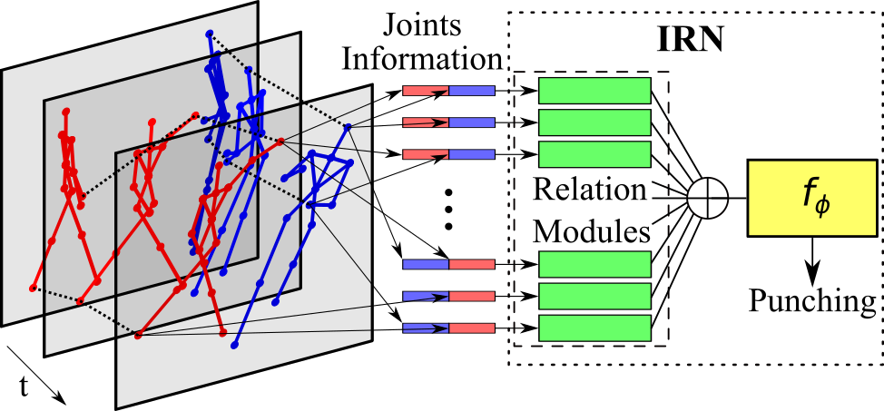

# Interaction Relational Network
Code used at paper "Interaction Relational Network for Mutual Action Recognition".

It contains an implementation of our Interaction Relational Network (IRN), an end-to-end NN tailored for Interaction Recognition using Skeleton information. 

<div align="center">
    
</div>

More details at the preprint: https://arxiv.org/abs/1910.04963

```
@misc{perez2019interaction,
    title={Interaction Relational Network for Mutual Action Recognition},
    author={Mauricio Perez and Jun Liu and Alex C. Kot},
    year={2019},
    eprint={1910.04963},
    archivePrefix={arXiv},
    primaryClass={cs.CV}
}
```

## Contents
1. [Requirements](#requirements)
2. [Reproducing Experiments](#reproducing-experiments)
3. [Results](#results)

## Requirements

Our proposed method Interaction Relational Network (IRN) was implemented on python, using Keras framework with TensorFlow as backend. Altough we have not tested with other backends, such as Theano, we believe it should not matter.

Software and libraries version:

- Python: 3.6.8
- Keras: 2.2.4
- TensorFlow: 1.14.0

## Reproducing Experiments

### Setting-up the datasets

Each dataset has a different initial setup, because of how they are made available at their respective project web-page, with SBU being the most straightforward to set-up.
Our code assume the data is available at *'data/'* folder at the same directory as *'src/'*, but that can be changed at the hard-coded parameter *DATA_DIR* in the source files at *'src/datasets/'*.

Here are the setup steps per dataset:

- **SBU**
	1. Download dataset from respective [project page](https://www3.cs.stonybrook.edu/~kyun/research/kinect_interaction/index.html) (Clean version)
	1. Unzip all zipped sets at the same folder: 'data/sbu/'
- **UT**
	1. Download dataset from respective [project page](http://cvrc.ece.utexas.edu/SDHA2010/Human_Interaction.html#Data) (segmented_set1 & segmented_set2)
	1. Run [OpenPose](https://github.com/CMU-Perceptual-Computing-Lab/openpose) to extract skeleton information
	1. Save extracted keypoints at 'data/ut-interaction/'. Check 'src/datasets/UT.py' for an explanation on the expected directory structure.
	- **Obs:** Alternatively we provide the skeleton information extracted by us [here](https://drive.google.com/file/d/1gh_1OBjUbfBg2KEmypfZxgmoguoXpRZp/view?usp=sharing)
- **NTU** and **NTU-V2**
	1. Although the dataset is available at its [project page](http://rose1.ntu.edu.sg/datasets/actionrecognition.asp), it is recommended to download only the  skeletons at [github page](https://github.com/shahroudy/NTURGB-D/).
	1. Run script `src/set-up_ntu_skl.py` to read the skeletons from the zip files and generate a single csv file with all the normalized coordinates.
		- Run first for version 1: `python src/set-up_ntu_skl.py 1`
		- Then for version 2: `python src/set-up_ntu_skl.py 2`
		- **Obs:** These can take several minutes to complete.
	1. Run script `src/set-up_ntu_skl.py` with `-c` option to convert csv files to npy (faster to read).
		- Ex: `python src/set-up_ntu_skl.py 1 -c` and `python src/set-up_ntu_skl.py 2 -c`
		- **Obs:** These can take several minutes to complete.

If the data is obtained in a different way, or is stored at a different format,
it is necessary to adapt the code at 'src/datasets' and 'src/misc/data_io.py'.

### Running the code

Our experiments hyperparameters are stored in the configuration files at folder *'configs/'*, so to reproduce our experiments is only necessary to setup the datasets and run the script `run_protocol.py` with the adequate configuration files.

How to use `run_protocol.py`:

```
python src/run_protocol.py EXPERIMENT_NAME \
	configs/DATASET/EXPERIMENT_NAME.cfg \
	DATASET \
	[OPTIONS]
```

Usage examples:

```
python src/run_protocol.py IRN_inter \
	configs/SBU/IRN_inter.cfg SBU

python src/run_protocol.py IRN_inter+intra \
	configs/SBU/IRN_inter+intra.cfg SBU -F middle

python src/run_protocol.py LSTM-IRN_inter \
	configs/SBU/LSTM-IRN_inter.cfg SBU -t

python src/run_protocol.py LSTM-IRN_inter+intra \
	configs/SBU/LSTM-IRN_inter+intra.cfg SBU -t -F middle

python src/run_protocol.py LSTM-IRN_inter \
	configs/NTU-V1/LSTM-IRN_inter.cfg NTU -t -f cross_subject
```

## Results

Results from some of our proposed methods on the following datasets:

### SBU

Method | Accuracy
------------ | -------------
LSTM-IRN_inter | 94.6%
LSTM-IRN_intra | 95.2%
LSTM-IRN-fc1_inter+intra | 98.2%

### UT

Method | Set 1 | Set 2
------------ | ------------- | -------------
LSTM-IRN_inter | 93.3% | 96.7%
LSTM-IRN_intra | 96.7% | 91.7%
LSTM-IRN-fc1_inter+intra | 98.3% | 96.7%

### NTU V1

Method | Cross-Subject | Cross-View
------------ | ------------- | -------------
LSTM-IRN_inter | 89.5% | 92.8%
LSTM-IRN_intra | 87.3% | 91.7%
LSTM-IRN-fc1_inter+intra | 90.5% | 93.5%

Obs: Mutual actions only

### NTU V2

Method | Cross-Subject | Cross-Setup
------------ | ------------- | -------------
LSTM-IRN_inter | 74.3% | 75.6%
LSTM-IRN_intra | 73.6% | 75.2%
LSTM-IRN-fc1_inter+intra | 77.7% | 79.6%

Obs: Mutual actions only
